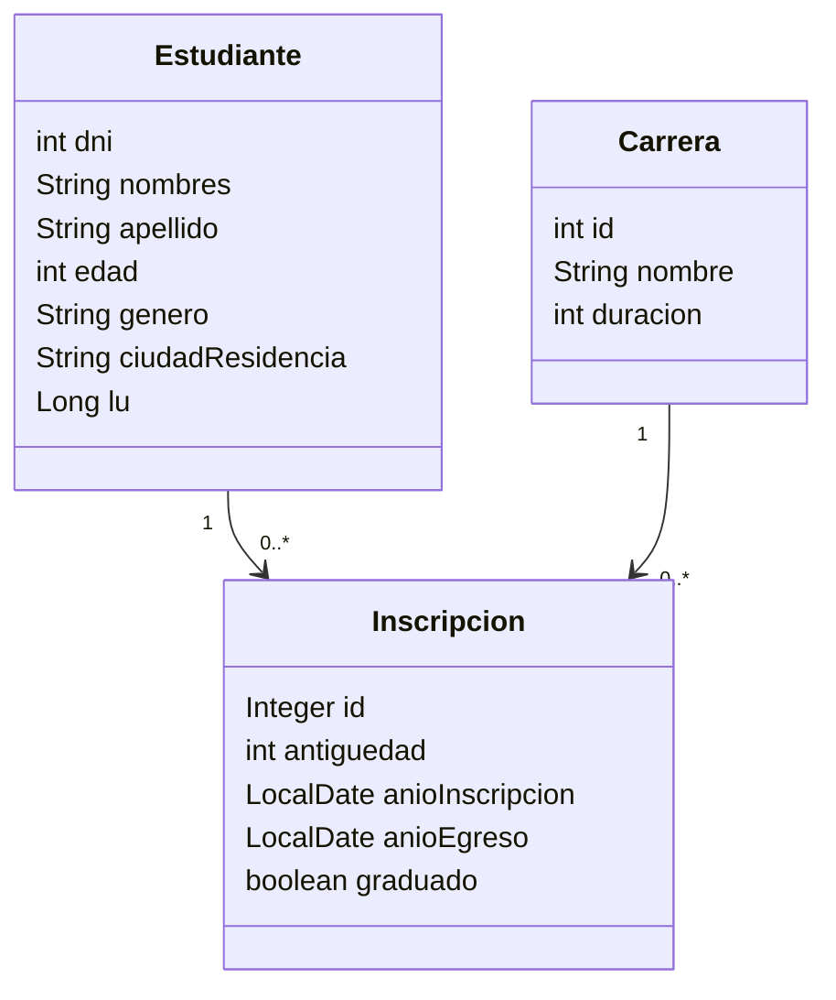
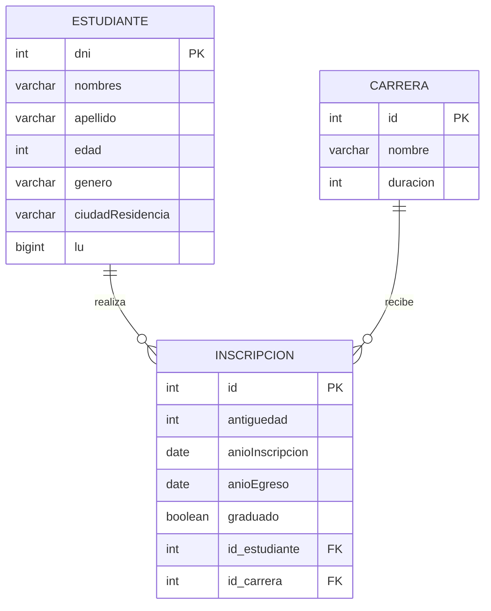

# TP2 Integrador - Arquitecturas Web

## Consigna

### 1. Modelo

El registro contiene:
- Estudiante: nombres, apellido, edad, género, DNI, ciudad de residencia y libreta universitaria.
- Carrera: nombre y duración.
- Inscripción: relaciona estudiante y carrera, y guarda antigüedad, año de inscripción, año de egreso y si se graduó.

### Diagrama de objetos / clases



### DER



## Consultas implementadas

- **2a:** alta de estudiante mediante `RepositoryEstudiante.save()`.
- **2b:** matrícula mediante `RepositoryCarrera.matricularEstudianteEnCarrera()`.
- **2c:** todos los estudiantes ordenados por nombre.
- **2d:** estudiante por número de libreta universitaria.
- **2e:** estudiantes por género.
- **2f:** carreras con inscriptos, ordenadas por cantidad descendente.
- **2g:** estudiantes de una carrera filtrados por ciudad.
- **3:** reporte por carrera y año con inscriptos y egresados, ordenado por carrera y año.

Las consultas de recuperación están resueltas principalmente con **JPQL**.

## Base de datos

Levantar MySQL con:

```bash
docker compose -f msql.yml up -d
```

Configuración:
- Base: `entregable2`
- Usuario: `root`
- Password: `password`
- Puerto: `3306`

El esquema se genera automáticamente con Hibernate (`create-drop`).

## Ejecución

Ejecutar:

```
src/main/java/org/example/Main.java
```

El `Main` carga los CSV y muestra ejemplos de las consultas 2c a 2g y del reporte del punto 3.
